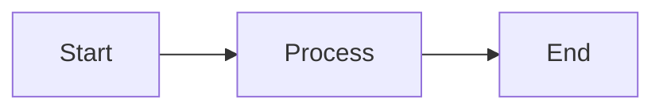
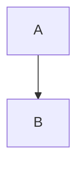

# Bloggy

**A lightweight, elegant blogging platform built with FastHTML that renders Markdown files into beautiful web pages with advanced interactive features.**

[](https://www.python.org/downloads/)
[](https://github.com/AnswerDotAI/fasthtml)
[](LICENSE)

---

## Table of Contents

1. [Overview](#overview)
2. [Installation](#installation)
3. [Quick Start](#quick-start)
4. [Architecture](#architecture)
5. [Core Features](#core-features)
6. [Markdown Extensions](#markdown-extensions)
7. [Interactive Diagrams](#interactive-diagrams)
8. [Configuration](#configuration)
9. [Theming & Styling](#theming--styling)
10. [Authentication](#authentication)
11. [Static Site Generation](#static-site-generation)
12. [API Reference](#api-reference)
13. [Project Structure](#project-structure)
14. [Technical Deep Dive](#technical-deep-dive)

---

## Overview

Bloggy transforms a folder of Markdown files into a modern, interactive blog with:

| Feature Category | Capabilities |
|-----------------|--------------|
| **FastHTML Integration** | High-performance Python web framework with built-in HTMX support |
| **Advanced Markdown** | Footnotes as sidenotes, YouTube embeds, task lists, math notation, tabbed content |
| **Interactive Diagrams** | Mermaid.js with zoom, pan, fullscreen, and theme-aware re-rendering |
| **Modern UI** | Responsive three-panel layout, dark mode, HTMX navigation, mobile menus |
| **Developer Experience** | Hot reload, performance logging, lazy loading, smart caching |

---

## Installation

### From PyPI (Recommended)

```bash
pip install bloggy
```

### From Source

```bash
git clone https://github.com/yeshwanth/bloggy.git
cd bloggy
pip install -e .
```

### Dependencies

Bloggy automatically installs:
- `fasthtml` - Modern Python web framework
- `mistletoe` - Extensible Markdown parser
- `python-frontmatter` - YAML frontmatter parsing
- `monsterui` - UI component library
- `uvicorn` - ASGI server
- `loguru` - Advanced logging

---

## Quick Start

### 1. Create Your Blog Directory

```bash
mkdir my-blog && cd my-blog
echo "# Welcome to My Blog" > index.md
echo "# My First Post" > hello-world.md
```

### 2. Run Bloggy

```bash
bloggy .
```

### 3. Open Your Browser

Navigate to `http://127.0.0.1:5001`

### CLI Options

```bash
# Run on specific directory
bloggy /path/to/markdown/files

# Run on all network interfaces
bloggy . --host 0.0.0.0

# Use custom port
bloggy . --port 8000

# Disable auto-reload
bloggy . --no-reload

# Enable authentication
bloggy . --user admin --password secret

# Build static site
bloggy build . -o ./dist
```

---

## Architecture

### Request Flow

```
User Request → FastHTML Router → Route Handler → Markdown Parser
     ↓                                               ↓
  Browser  ←  HTMX Response  ←  Layout Engine  ←  ContentRenderer
```

### Component Overview

| Component | File | Purpose |
|-----------|------|---------|
| **Core Application** | `core.py` | FastHTML app, routes, layout, markdown rendering |
| **Entry Point** | `main.py` | CLI interface, server configuration |
| **Configuration** | `config.py` | TOML config loading, environment variables |
| **Static Builder** | `build.py` | Generate static HTML sites |
| **Client Scripts** | `static/scripts.js` | Mermaid interactions, theme handling |
| **Sidenote Styles** | `static/sidenote.css` | Footnote/sidenote responsive styling |

### Key Classes

- **`BloggyConfig`**: Configuration management with priority (file > env > defaults)
- **`ContentRenderer`**: Custom Mistletoe renderer for extended markdown
- **`FrankenRenderer`**: Base renderer with image path resolution

---

## Core Features

### 🎨 Modern UI Components

#### Three-Panel Layout
- **Left Sidebar**: Collapsible file tree with folder/file icons
- **Main Content**: Swappable content area with HTMX
- **Right Sidebar**: Auto-generated Table of Contents

#### Navigation Features
- **Sticky Navbar**: Blog title, theme toggle, mobile menu buttons
- **Keyboard Shortcuts**: `Z` for posts sidebar, `X` for TOC
- **Mobile Menus**: Full-screen slide-in panels for posts and TOC
- **Active Link Highlighting**: Blue ring highlight on current post/section

#### Visual Polish
- **Frosted Glass Effect**: `backdrop-blur-lg` on sidebar panels
- **Ultra-Thin Scrollbars**: 3px custom scrollbars (light/dark adaptive)
- **Smooth Transitions**: CSS transitions on all interactive elements

### 🚀 Performance Optimizations

#### Caching Strategy
```python
# Frontmatter caching by file mtime
_frontmatter_cache[file_path] = (mtime, (metadata, content))

# LRU cache for post tree with fingerprint invalidation
@lru_cache(maxsize=1)
def _cached_build_post_tree(fingerprint): ...

# Sidebar HTML cache
@lru_cache(maxsize=1)
def _cached_posts_sidebar_html(fingerprint): ...
```

#### HTMX Optimization
- **Partial Updates**: Only swaps `#main-content`, not full page
- **Out-of-Band Swaps**: TOC sidebar updates via `hx_swap_oob="true"`
- **Lazy Loading**: Posts sidebar loaded via `/_sidebar/posts` endpoint
- **Push URL**: Browser history preserved with `hx-push-url="true"`

#### Logging & Debugging
```python
# Performance timing in logs
logger.debug(f"[DEBUG] Markdown rendering took {md_time:.2f}ms")
logger.debug(f"[DEBUG] Layout generation took {layout_time:.2f}ms")

# Log file: /tmp/bloggy_core.log (10 MB rotation, 10 days retention)
```

### 🔍 Search & Navigation

#### Sidebar Search
- **Real-time Filtering**: HTMX-powered with 300ms debounce
- **Regex Support**: Use `/pattern/` syntax for regex search
- **Gather Results**: Bulk export search results for LLM context

#### File Tree Navigation
- **Collapsible Folders**: Chevron indicators, smooth expand/collapse
- **Auto-Expand**: Active post automatically revealed in sidebar
- **Custom Ordering**: Per-folder `.bloggy` files control sort order

---

## Markdown Extensions

### Footnotes as Sidenotes

**Syntax:**
```markdown
This is a claim[^1] that needs supporting evidence.

[^1]: Supporting evidence goes here with **markdown** support.
```

**Behavior:**
- Desktop (1280px+): Displays in right margin as sidenote
- Mobile: Expandable toggle with smooth animation
- Amber/blue border styling (light/dark themes)

### YouTube Embeds

**Syntax:**
```markdown
[yt:dQw4w9WgXcQ]
[yt:dQw4w9WgXcQ|Optional caption text]
```

**Features:**
- Responsive 16:9 aspect ratio container
- Rounded corners with border styling
- Optional caption in gray below video

### Task Lists

**Syntax:**
```markdown
- [ ] Unchecked task (gray background)
- [x] Checked task (green with SVG checkmark)
```

**Styling:**
- Custom inline-flex layout (no bullet points)
- Green background with white checkmark for completed
- Gray background for pending items

### Tabbed Content

**Syntax:**
````markdown
:::tabs
::tab{title="Python"}
```python
print("Hello from Python!")
```

::tab{title="JavaScript"}
```javascript
console.log("Hello from JS!");
```
:::
````

**Features:**
- Smooth fade-in animation (0.2s)
- Height stabilization prevents layout shifts
- Full markdown rendering inside tabs
- Frosted glass aesthetic

### Math Notation (KaTeX)

**Syntax:**
```markdown
Inline math: $E = mc^2$

Block math:
$$
\int_{-\infty}^{\infty} e^{-x^2} dx = \sqrt{\pi}
$$
```

**Features:**
- Auto-renders on page load and after HTMX swaps
- `throwOnError: false` for graceful degradation

### Superscript & Subscript

**Syntax:**
```markdown
H~2~O (subscript)
E = mc^2^ (superscript)
~~strikethrough text~~
```

### Pandoc-Style Attributes

**Syntax:**
```markdown
The variable `x`{.variable} represents position.
Use `important`{.emphasis #unique-id} for emphasis.
```

**Renders as:**
```html
<span class="variable">x</span>
<span class="emphasis" id="unique-id">important</span>
```

**Supported Attributes:**
- Classes: `.classname`
- IDs: `#element-id`
- Key-value: `lang=python`

### Relative Links

**Syntax:**
```markdown
[Next Chapter](./chapter-02.md)
[Parent Section](../index.md)
```

**Behavior:**
- Automatically resolves to correct route
- Strips `.md` extension
- Adds HTMX attributes for SPA navigation
- External links get `target="_blank"`

---

## Interactive Diagrams

### Mermaid Diagram Support

Bloggy provides full Mermaid.js v11 support with interactive controls:

#### Basic Usage

````markdown

````

#### Frontmatter Configuration

````markdown

````

**Frontmatter Options:**

| Key | Default | Description |
|-----|---------|-------------|
| `width` | `65vw` | Container width (vw, px, %) |
| `height` | `auto` | Container height |
| `min-height` | `400px` | Minimum container height |
| `aspect_ratio` | - | For Gantt charts (e.g., `16:9`, `21:9`) |

### Interactive Controls

Each diagram includes a control bar:

| Button | Function | Description |
|--------|----------|-------------|
| **⛶** | Fullscreen | Opens diagram in modal overlay |
| **Reset** | Reset Zoom | Restores original scale and position |
| **+** | Zoom In | Increases scale by 10% |
| **−** | Zoom Out | Decreases scale by 10% |

### Mouse Interactions

- **Wheel Zoom**: Zooms toward cursor position (1% per wheel event)
- **Click & Drag**: Pans the diagram
- **Smart Scaling**: Wide diagrams (aspect > 3:1) scale to width

### Theme-Aware Rendering

- MutationObserver watches `<html>` class for `.dark`
- Diagrams automatically re-render on theme change
- Preserves wrapper height during re-render to prevent layout shifts

### Supported Diagram Types

- Flowcharts (`graph`, `flowchart`)
- Sequence diagrams
- Class diagrams
- State diagrams
- Entity-Relationship diagrams
- Gantt charts
- Pie charts
- Git graphs
- Mind maps

---

## Configuration

### Configuration Priority

1. **`.bloggy` file** (TOML format) - Highest priority
2. **Environment variables** - Fallback
3. **Default values** - Final fallback

### `.bloggy` File Format

```toml
# =============================================================================
# BLOGGY CONFIGURATION FILE
# =============================================================================

# Blog title (default: derives from root folder name)
title = "My Awesome Blog"

# Root folder containing markdown files (default: ".")
root = "."

# Server configuration
host = "127.0.0.1"    # Use "0.0.0.0" for network access
port = 5001

# UI preferences
sidebars_open = true  # Sidebars expanded by default

# Layout width (Tailwind class or CSS value)
layout_max_width = "max-w-7xl"  # or "90vw", "1200px"

# Authentication (optional - enables session-based auth)
username = "admin"
password = "secret"

# =============================================================================
# SIDEBAR ORDERING (per-folder)
# =============================================================================

# Pin specific items to top (exact names with extensions)
order = ["getting-started.md", "tutorials", "advanced.md"]

# Sort method for remaining items
sort = "name_asc"  # Options: name_asc, name_desc, mtime_asc, mtime_desc

# Folder positioning
folders_first = true        # Sort folders before files
folders_always_first = false  # Force folders to top after all sorting
```

### Environment Variables

| Variable | Default | Description |
|----------|---------|-------------|
| `BLOGGY_ROOT` | `.` | Path to markdown files |
| `BLOGGY_TITLE` | Folder name | Blog title |
| `BLOGGY_HOST` | `127.0.0.1` | Server host |
| `BLOGGY_PORT` | `5001` | Server port |
| `BLOGGY_USER` | - | Auth username |
| `BLOGGY_PASSWORD` | - | Auth password |
| `BLOGGY_SIDEBARS_OPEN` | `true` | Sidebars expanded |
| `BLOGGY_LAYOUT_MAX_WIDTH` | `max-w-7xl` | Layout width |

### Per-Folder Configuration

Place `.bloggy` files in any folder to control ordering:

```
my-blog/
├── .bloggy              # Root config
├── tutorials/
│   ├── .bloggy          # tutorials/ ordering config
│   ├── 01-basics.md
│   └── 02-advanced.md
└── reference/
    └── .bloggy          # reference/ ordering config
```

---

## Theming & Styling

### Dark Mode

- **Toggle**: Click moon/sun icon in navbar
- **Persistence**: Saved in `localStorage.__FRANKEN__`
- **Instant**: No page reload required
- **Diagram Support**: Mermaid diagrams re-render automatically

### Custom CSS

#### Global Styles

Create `custom.css` or `style.css` in your blog root:

```css
/* /my-blog/custom.css - applies to all posts */
span.variable {
    color: #e06c75;
    font-weight: 500;
}

span.emphasis {
    background: linear-gradient(120deg, #84fab0 0%, #8fd3f4 100%);
    padding: 2px 6px;
    border-radius: 3px;
}
```

#### Folder-Specific Styles

Create `custom.css` in any subfolder (automatically scoped):

```css
/* /my-blog/tutorials/custom.css */
/* Automatically scoped to #main-content.section-tutorials */

span.variable {
    color: #61afef;  /* Override for tutorials only */
}
```

#### CSS Cascade Order

1. Framework CSS (Bloggy internals)
2. Root `custom.css` (global)
3. Folder `custom.css` (auto-scoped)

### Typography

| Element | Font |
|---------|------|
| Body Text | IBM Plex Sans (400, 500, 600, 700) |
| Code | IBM Plex Mono |
| Headings | IBM Plex Sans (bold) |

### Responsive Breakpoints

| Breakpoint | Width | Layout |
|------------|-------|--------|
| Mobile | < 768px | Single column, slide-in menus |
| Tablet | 768px - 1279px | Three columns, no margin sidenotes |
| Desktop | 1280px+ | Full layout with margin sidenotes |

---

## Authentication

### Enabling Authentication

Set credentials via `.bloggy` file:

```toml
username = "admin"
password = "your-secure-password"
```

Or environment variables:

```bash
export BLOGGY_USER="admin"
export BLOGGY_PASSWORD="your-secure-password"
```

Or CLI arguments:

```bash
bloggy . --user admin --password secret
```

### Authentication Flow

1. Unauthenticated request → Redirect to `/login`
2. Original URL saved in session as `next`
3. Login form validates credentials
4. Success → Session cookie set, redirect to `next`
5. Failure → Show error, stay on login page

### Protected Routes

When auth is enabled, all routes require login except:
- `/login` - Login page
- `/_sidebar/*` - Sidebar endpoints
- `/static/*` - Static files
- `*.css`, `*.js` - Asset files

---

## Static Site Generation

### Build Command

```bash
# Build to default ./dist directory
bloggy build /path/to/blog

# Build to custom output directory
bloggy build /path/to/blog -o /path/to/output
```

### What Gets Generated

```
dist/
├── index.html           # Home page (from index.md or README.md)
├── posts/
│   ├── first-post.html
│   ├── tutorials/
│   │   ├── getting-started.html
│   │   └── advanced.html
│   └── ...
└── static/
    ├── scripts.js
    ├── sidenote.css
    └── favicon.png
```

### Static Site Features

- **Navigation**: `.html` links instead of HTMX
- **Theme Toggle**: Works via `localStorage`
- **Syntax Highlighting**: Highlight.js included
- **Math Rendering**: KaTeX included
- **Mermaid Diagrams**: Full interactive support
- **Tab Switching**: JavaScript-powered tabs

### Deployment

```bash
# Preview locally
cd dist && python -m http.server 8000

# Deploy to static host
# Upload dist/ contents to GitHub Pages, Netlify, Vercel, etc.
```

---

## API Reference

### Routes

| Route | Method | Description |
|-------|--------|-------------|
| `/` | GET | Home page (index.md or welcome) |
| `/posts/{path}` | GET | Render markdown post |
| `/posts/{path}.md` | GET | Raw markdown source |
| `/posts/{path}.{ext}` | GET | Static assets (images, etc.) |
| `/_sidebar/posts` | GET | Lazy-loaded posts sidebar |
| `/_sidebar/posts/search` | GET | Search results endpoint |
| `/search/gather` | GET | Bulk search export |
| `/login` | GET/POST | Authentication (when enabled) |
| `/{path}` | GET | 404 catch-all |

### Key Functions

#### `core.py`

```python
# Markdown rendering
def from_md(content, img_dir=None, current_path=None) -> Div

# Post tree building
def build_post_tree(folder) -> List[Li]
def get_posts() -> List[Li]  # Cached version

# TOC extraction
def extract_toc(content) -> List[Tuple[level, text, anchor]]
def build_toc_items(headings) -> List[Li]

# Layout generation
def layout(*content, htmx, title, show_sidebar, toc_content, current_path, show_toc) -> Tuple

# Configuration
def get_root_folder() -> Path
def get_blog_title() -> str
```

#### `config.py`

```python
class BloggyConfig:
    def get(key, env_var, default) -> Any
    def get_root_folder() -> Path
    def get_blog_title() -> str
    def get_host() -> str
    def get_port() -> int
    def get_auth() -> Tuple[str, str]
    def get_sidebars_open() -> bool

def get_config() -> BloggyConfig  # Global singleton
def reload_config(config_path=None) -> BloggyConfig
```

#### `build.py`

```python
def build_static_site(input_dir=None, output_dir=None) -> Path
def generate_static_html(title, body_content, blog_title) -> str
def static_layout(content_html, blog_title, page_title, nav_tree, toc_items, current_path) -> str
```

---

## Project Structure

```
bloggy/
├── bloggy/
│   ├── __init__.py          # Package initialization
│   ├── core.py              # Main application (2100+ lines)
│   │   ├── FastHTML app setup
│   │   ├── Route handlers (/, /posts/{path}, etc.)
│   │   ├── Markdown processing pipeline
│   │   ├── ContentRenderer class
│   │   ├── Layout generation
│   │   └── Sidebar building
│   ├── main.py              # CLI entry point
│   │   ├── cli() function
│   │   ├── Argument parsing
│   │   └── Uvicorn server launch
│   ├── config.py            # Configuration management
│   │   ├── BloggyConfig class
│   │   ├── TOML file loading
│   │   └── Environment variable fallback
│   ├── build.py             # Static site generator
│   │   ├── build_static_site()
│   │   ├── generate_static_html()
│   │   └── Static layout generation
│   └── static/
│       ├── scripts.js       # Client-side interactions (36KB)
│       │   ├── Mermaid zoom/pan/fullscreen
│       │   ├── Theme-aware re-rendering
│       │   ├── HTMX event handlers
│       │   └── Mobile menu management
│       ├── sidenote.css     # Sidenote responsive styles
│       └── favicon.png
├── demo/                    # Example blog content
├── docs/                    # Documentation
├── pyproject.toml          # Package configuration
├── setup.py                # Legacy setup
└── README.md               # Main documentation
```

---

## Technical Deep Dive

### Markdown Processing Pipeline

```
Raw Markdown
    ↓
1. parse_frontmatter() - Extract YAML metadata
    ↓
2. extract_footnotes() - Remove [^label]: definitions
    ↓
3. preprocess_super_sub() - Convert ^text^ and ~text~ to HTML
    ↓
4. preprocess_tabs() - Replace :::tabs with placeholders
    ↓
5. _preserve_newlines() - Add markdown softbreaks
    ↓
6. mst.Document() - Mistletoe token parsing
    ↓
7. ContentRenderer.render() - Custom token rendering
    ↓
8. postprocess_tabs() - Replace placeholders with rendered tabs
    ↓
9. apply_classes() - Add Tailwind CSS classes
    ↓
Final HTML
```

### Custom Token Renderers

| Token | Precedence | Pattern | Renderer |
|-------|------------|---------|----------|
| `InlineCodeAttr` | 8 | `` `code`{.class} `` | `render_inline_code_attr` |
| `Superscript` | 7 | `^text^` | `render_superscript` |
| `Subscript` | 7 | `~text~` | `render_subscript` |
| `Strikethrough` | 7 | `~~text~~` | `render_strikethrough` |
| `YoutubeEmbed` | 6 | `[yt:VIDEO_ID]` | `render_youtube_embed` |
| `FootnoteRef` | 5 | `[^label]` | `render_footnote_ref` |

### Caching Implementation

```python
# File-based cache with mtime validation
def parse_frontmatter(file_path):
    mtime = file_path.stat().st_mtime
    if cache_key in _frontmatter_cache:
        cached_mtime, cached_data = _frontmatter_cache[cache_key]
        if cached_mtime == mtime:
            return cached_data  # Cache hit
    # Cache miss - read and parse file
    result = (metadata, content)
    _frontmatter_cache[cache_key] = (mtime, result)
    return result

# Fingerprint-based LRU cache
def _posts_tree_fingerprint():
    return max(p.stat().st_mtime for p in root.rglob("*.md"))

@lru_cache(maxsize=1)
def _cached_build_post_tree(fingerprint):
    return build_post_tree(get_root_folder())
```

### HTMX Integration Details

```python
# Route with HTMX detection
@rt('/posts/{path:path}')
def post_detail(path: str, htmx):
    if htmx and getattr(htmx, "request", None):
        # Return partial update
        return (
            Title(title),
            Main(*content, id="main-content"),
            Aside(..., hx_swap_oob="true", id="toc-sidebar"),
        )
    # Return full page
    return layout(...)
```

### Mermaid Interaction State

```javascript
// Per-diagram state management
const mermaidStates = {
    'mermaid-abc123': {
        scale: 1.0,
        translateX: 0,
        translateY: 0,
        isPanning: false,
        startX: 0,
        startY: 0
    }
};

// Transform application
function applyTransform(wrapper, state) {
    const svg = wrapper.querySelector('svg');
    svg.style.transform = `translate(${state.translateX}px, ${state.translateY}px) scale(${state.scale})`;
}
```

### Security Measures

1. **HTML Escaping**: All code blocks automatically escaped
2. **External Links**: `rel="noopener noreferrer"` added
3. **Path Validation**: Relative paths checked against root
4. **Session Auth**: Starlette sessions (not URL-based)
5. **CSRF Protection**: POST forms with proper encoding

---

## Contributing

See [CONTRIBUTING.md](CONTRIBUTING.md) for development setup and guidelines.

## Publishing

See [PUBLISHING.md](PUBLISHING.md) for PyPI release instructions.

## License

Apache 2.0 - See [LICENSE](LICENSE) for details.

---

**Built with ❤️ using [FastHTML](https://github.com/AnswerDotAI/fasthtml) and [Mistletoe](https://github.com/miyuchina/mistletoe)**
