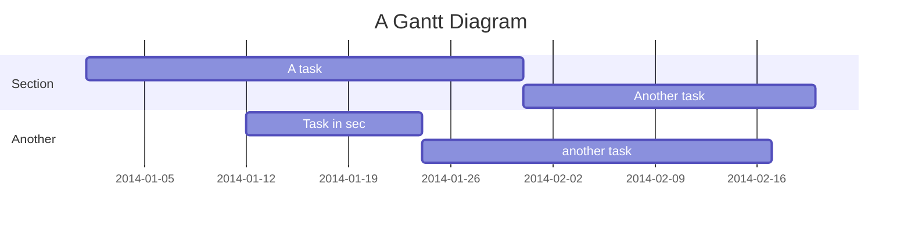

## Headings

### Setext Style

Heading Level 1
===============

Heading Level 2
---------------

### ATX Style

# Heading Level 1
## Heading Level 2
### Heading Level 3
#### Heading Level 4
##### Heading Level 5

## Paragraphs

This is a paragraph. It contains multiple sentences to demonstrate how paragraphs work in Markdown.

## Line Breaks

Soft line break (just press Enter):
This is the next line.

Hard line break (use two spaces at the end of the line):  
This is the next line.

## Emphasis

*Italics* using single asterisks.  
_Italics_ using single underscores.

**Bold** using double asterisks.  
__Bold__ using double underscores.

***Bold and Italics*** using triple asterisks.  
___Bold and Italics___ using triple underscores.

## Blockquotes

> This is a blockquote.
>
> > Nested blockquote.

## Lists

### Ordered List

1. First item
2. Second item
3. Third item

### Unordered List

- First item
- Second item
- Third item

### Nested List

- Parent item
  - Child item
    - Grandchild item

### Task List

- [x] Completed task
- [ ] Incomplete task

## Code

### Inline Code

Use `inline code` for short snippets.

### Indented Code Block

    def hello_world():
        print("Hello, world!")

### Fenced Code Block

```python
def hello_world():
    print("Hello, world!")
```

## Horizontal Rules

---

## Links

### Inline Links

[Visit Google](https://www.google.com)

### Reference-Style Links

[Visit Google][google]

[google]: https://www.google.com

### Autolinks

<https://www.example.com>

## Images

### Inline Image


### Reference-Style Image

![Alt text][image]

[image]: https://via.placeholder.com/150

## HTML

This is <b>bold</b> and this is <i>italic</i>.

## Strikethrough

~~This text is strikethrough.~~

## Tables

| Column 1 | Column 2 | Column 3 |
|----------|----------|----------|
| Row 1    | Data     | Data     |
| Row 2    | Data     | Data     |

## Footnotes

This is a footnote reference[^1].

[^1]: This is the footnote text.

## Definition Lists

Term  
: Definition

## Abbreviations

The HTML abbreviation is HTML. It stands for *HyperText Markup Language*.

*[HTML]: HyperText Markup Language

## Superscript and Subscript

E = mc^2^  
H~2~O

## Highlight Text

==Highlighted text==

## Insertion and Deletion

{++Inserted text++}  
{--Deleted text--}

## Comments

<!-- This is a comment -->

## Emoji

:smile: :+1: :heart:

## Table of Contents

[TOC]

## Heading IDs

### Custom Heading {#custom-id}

## Raw HTML Blocks

<div style="color: red;">This is red text.</div>

## Embedded Media

### Video

<video controls>
  <source src="movie.mp4" type="video/mp4">
</video>

### Audio

<audio controls>
  <source src="audio.mp3" type="audio/mpeg">
</audio>

## Mathematical Notation

### Inline Math

$E = mc^2$

### Block Math

$$
\int_a^b f(x) dx = F(b) - F(a)
$$

## Diagrams
````

````
will render to


## Smart Typography

"Curly quotes"  
-- En-dash  
--- Em-dash

## Custom Containers

> [!NOTE]
> This is a note.

> [!WARNING]
> This is a warning.

## Collapsible Sections

<details>
<summary>Click to expand</summary>

Hidden content here.

</details>

## Keyboard Input

Press <kbd>Ctrl</kbd> + <kbd>C</kbd> to copy.

## Line Block

| Roses are red  
| Violets are blue

## Citation

This is a citation [@doe2025].

## Page Break

\pagebreak

## Escaping Characters

\*Not italicized\*

## Tabbed Content

You can create tabbed sections to show multiple versions of content, like code in different languages or rendered output vs source code.

:::tabs
::tab{title="Rendered"}
This is the **rendered output** with _markdown formatting_.

- List item 1
- List item 2
- List item 3

```python
print("Hello, World!")
```
::tab{title="Markdown Source"}
```markdown
This is the **rendered output** with _markdown formatting_.

- List item 1
- List item 2
- List item 3

\`\`\`python
print("Hello, World!")
\`\`\`
```
::tab{title="HTML"}
```html
<div>
  <p>This is the <strong>rendered output</strong> with <em>markdown formatting</em>.</p>
  <ul>
    <li>List item 1</li>
    <li>List item 2</li>
    <li>List item 3</li>
  </ul>
</div>
```
:::