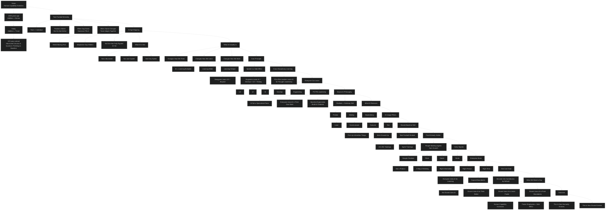

```mermaid
---
config:
    theme: dark
---
graph TD

A[Vision<br/>Human Capability Evolution] --> A1[1000 years ago<br/>Addition = Genius]
A1 --> A2[Today<br/>Addition = Trivial]
A2 --> A3[100 years ahead<br/>Advanced Calculus & Quantum Thinking as Baseline]

A --> B[Total Football Mentality]
B --> B1[Team > Individual]
B --> B2[Positions Matter<br/>But Do Not Define]
B --> B3[When Gap Exists<br/>Someone Fills It]
B --> B4[When Game Changes<br/>Team Adapts Together]

B --> C[AI Age Mapping]
C --> C1[World Moving Fast]
C --> C2[Adaptation Gap Widens]
C --> C3[No One Has Fully Figured AI Yet]

C --> D[What AI Is Not]
D --> D1[Not a Buzzword]
D --> D2[Not Just Copilot]
D --> D3[Not Only Speed]

C --> E[What AI Actually Is]
E --> E1[Changes How We Think]
E --> E2[Changes How We Learn]
E --> E3[Changes How We Work]

E --> F[Core Principle]
F --> F1[AI = Learning Multiplier]
F --> F2[Learning Wider]
F --> F3[Learning Deeper]
F --> F4[Speed Is a Side Effect]

F --> G[Cross-Disciplinary Learning]
G --> G1[Designers Learn UX + Beyond]
G --> G2[Engineers Learn AI + DevOps + UX + Testing]
G --> G3[POs PMs Leaders Learn AI for Thought Leadership]

G --> H[Everyone Can Learn]
H --> H1[UX]
H --> H2[UI]
H --> H3[AI]
H --> H4[DevOps]
H --> H5[Engineering]
H --> H6[PO PM Leadership]

H --> I[Divami AI Philosophy]
I --> I1[AI Not a Specialized Team]
I --> I2[Everyone Uses AI in Their Own Work]
I --> I3[Baseline Expectation<br/>Build AI Chatbots]
I --> I4[Chatbots = Gateway Skill]

I --> J[What AI Removes]
J --> J1[Friction]
J --> J2[Waiting]
J --> J3[Dependency]

J --> K[AI Usage Pillars]
K --> K1[Learn]
K --> K2[Communicate]
K --> K3[Execute]
K --> K4[Test]

K --> L[Shared Baseline Skill]
L --> L1[Pick Up Unfamiliar Things]
L --> L2[Work Ground-Up]
L --> L3[Total Football Mindset]

L --> M[Proof Already Visible]
M --> M1[AI & ML Trainings]
M --> M2[Agent Trainings]
M --> M3[People Building Agents from Scratch]

M --> N[Early Signals]
N --> N1[Google Chatbots]
N --> N2[Ritvik]
N --> N3[Daksh]
N --> N4[Stride]

N --> O[Enterprise Brain]
O --> O1[Not a Product]
O --> O2[A Way of Working]
O --> O3[Right Information]
O --> O4[Right Person]
O --> O5[Right Time]

O --> P[One-Line Goal]
P --> P1[Everyone Uses AI for Learning]
P --> P2[Expand Boundaries]
P --> P3[Become 10x Contributors by Default]

P --> Q[What We Want to Say]
Q --> Q1["Not Divami Uses AI"]
Q --> Q2["Divami Uses AI to Think Better"]
Q --> Q3["Divami Uses AI to Learn Faster"]
Q --> Q4["Divami Uses AI to Push Boundaries"]

Q --> R[Outcome]
R --> R1[Human Capability Increases]
R --> R2[Faster Employees = Side Effect]
R --> R3[This Is How Humanity Evolves]
R --> R4[This Is How Divami Evolves]
```